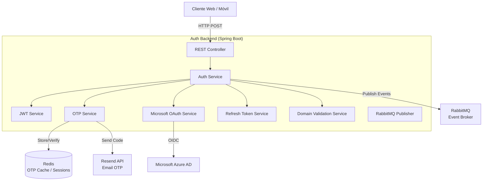
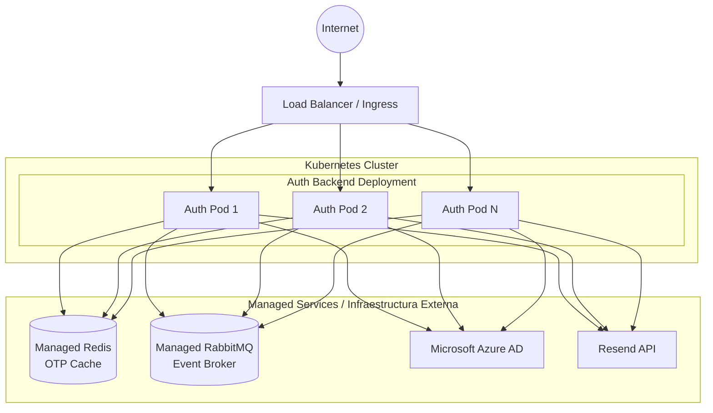

# Auth Backend Microservice

Este microservicio es responsable de la autenticación y autorización de usuarios dentro de la plataforma U-Link. Gestiona el ciclo completo de inicio de sesión, emisión de tokens JWT, refresh tokens, y validación de dominios institucionales. Forma parte del ecosistema **PATRICIA** y sirve como la capa de seguridad centralizada para todos los demás microservicios.

## ¿Qué hace el microservicio?

1. **Autenticación OTP por Email:** Genera y valida códigos de un solo uso (OTP) enviados por correo electrónico a través de la API de Resend. Los códigos se almacenan temporalmente en Redis con TTL configurable.
2. **OAuth2 con Microsoft Azure AD:** Integra autenticación institucional universitaria a través de Microsoft Entra ID (Azure AD), permitiendo SSO con credenciales de la universidad (`@mail.escuelaing.edu.co` y `@escuelaing.edu.co`).
3. **Emisión y Validación de JWT:** Emite tokens de acceso (access tokens) y de actualización (refresh tokens) firmados con HMAC-SHA256 (JJWT 0.12.6). Implementa rotación segura de refresh tokens.
4. **Validación de Dominios:** Restringe el registro y acceso a dominios de correo institucionales autorizados, asegurando que solo miembros de la universidad puedan usar la plataforma.
5. **Integración Orientada a Eventos:** Emite eventos de dominio a través de RabbitMQ (AMQP) cuando ocurren eventos de autenticación relevantes para otros microservicios.

---

## Parámetros de Calidad y Principios de Diseño

* **Principios SOLID:**
  * *Single Responsibility Principle (SRP):* Separación clara entre controladores de autenticación (`AuthController`), lógica de negocio (`AuthService`), gestión de JWT (`JwtService`), manejo de OTP (`OtpService`), autenticación OAuth2 (`MicrosoftOAuthService`), tokens de actualización (`RefreshTokenService`) y validación de dominios (`DomainValidationService`).
  * *Dependency Inversion Principle (DIP):* Uso de inyección de dependencias a través de constructores inyectados, desacoplando los componentes mediante interfaces.
* **Alta Disponibilidad y Escalabilidad Horizontal:** Estado de sesiones y OTP delegado a Redis, permitiendo escalar horizontalmente sin pérdida de estado.
* **Tolerancia a Fallos:** Configuración de *Health Probes* (liveness, readiness) a través de Spring Boot Actuator para integrarse con Kubernetes.
* **Testing y Code Coverage:** *Coverage Gate* con JaCoCo (mínimo 80% en líneas) en el pipeline de CI/CD.

---

## Diagrama de Arquitectura



---

## Diagrama de Despliegue



## Tecnologías Principales

* Java 21
* Spring Boot 3.3.5
* Spring Web, Spring Security
* Spring Data Redis
* Spring AMQP (RabbitMQ)
* Spring Cloud OpenFeign
* JJWT 0.12.6 (HMAC-SHA256)
* Spring OAuth2 Resource Server (Azure AD)
* Springdoc OpenAPI 2.6.0
* Spring Boot Actuator
* JaCoCo (Coverage)

## API Documentation

The service exposes a RESTful API documented via OpenAPI. Once the application is running, you can explore the API using the Swagger UI available at:
```
http://<HOST>:<PORT>/swagger-ui.html
```
The OpenAPI specification is generated automatically by Springdoc and can be accessed at `/v3/api-docs`.

## Running Locally

### Prerequisites
- Java 21 (or newer)
- Maven 3.9+
- Docker (optional, for containerized execution)
- Access to a Redis instance (local or remote)
- Access to a RabbitMQ broker (local or remote)
- Microsoft Azure AD credentials (for OAuth2 SSO)
- Resend API key (for OTP email delivery)

### Steps
1. Clone the repository and navigate to the project root.
2. Set the required environment variables (see *Configuration* section below).
3. Build the project:
   ```
   ./mvnw clean package
   ```
4. Run the application:
   ```
   java -jar target/auth-service-1.0.0.jar
   ```
   The service will start on port **8081** by default.

## Docker Deployment

A Dockerfile is provided for containerizing the microservice. Build and run the image with:
```bash
docker build -t auth-backend:latest .

docker run -d \
  -p 8081:8081 \
  -e "SPRING_PROFILES_ACTIVE=prod" \
  -e "SPRING_REDIS_HOST=redis" \
  -e "SPRING_RABBITMQ_HOST=rabbitmq" \
  -e "JWT_SECRET=your-secret-key" \
  -e "MICROSOFT_CLIENT_ID=your-client-id" \
  -e "MICROSOFT_CLIENT_SECRET=your-client-secret" \
  -e "RESEND_API_KEY=your-resend-key" \
  auth-backend:latest
```

A `docker-compose.yml` is also provided for local development with Redis and RabbitMQ:
```bash
docker-compose up -d
```

## Configuration

The service requires the following environment variables:

| Variable | Description | Required |
|----------|-------------|----------|
| `JWT_SECRET` | Secret key for JWT signing (HS256) | Yes |
| `MICROSOFT_CLIENT_ID` | Azure AD application client ID | Yes |
| `MICROSOFT_CLIENT_SECRET` | Azure AD application client secret | Yes |
| `RESEND_API_KEY` | API key for Resend email service | Yes |
| `SPRING_REDIS_HOST` | Redis host for OTP/session cache | Yes |
| `SPRING_RABBITMQ_HOST` | RabbitMQ host for domain events | Yes |
| `SPRING_RABBITMQ_USERNAME` | RabbitMQ username | Yes |
| `SPRING_RABBITMQ_PASSWORD` | RabbitMQ password | Yes |

## Testing

Unit and integration tests are located under `src/test/java`. Run the full test suite with:
```bash
./mvnw verify
```
Coverage is enforced by JaCoCo with a minimum of **80%** line coverage.

## Contributing

Contributions are welcome! Please follow these steps:
1. Fork the repository.
2. Create a feature branch (`git checkout -b feature/awesome-feature`).
3. Implement your changes, ensuring existing tests pass and adding new tests if needed.
4. Submit a Pull Request with a clear description of the changes.

All contributions must adhere to the project's coding standards and pass the CI pipeline.

## License

This project is licensed under the **Apache License 2.0**. See the `LICENSE` file for details.
